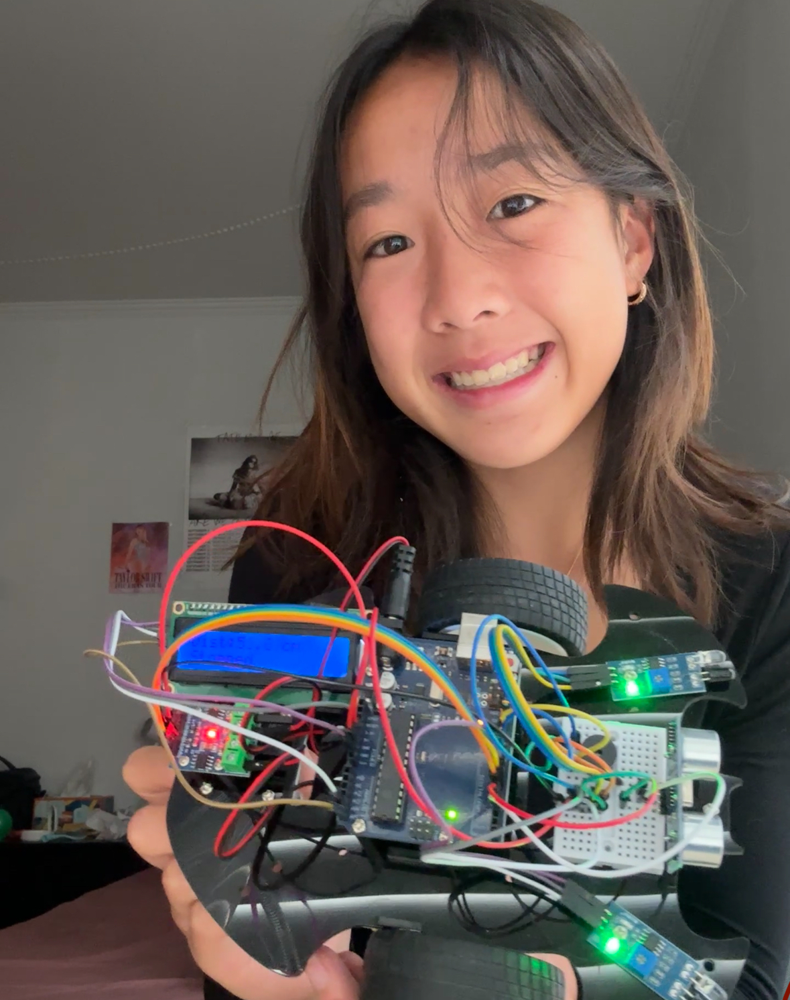
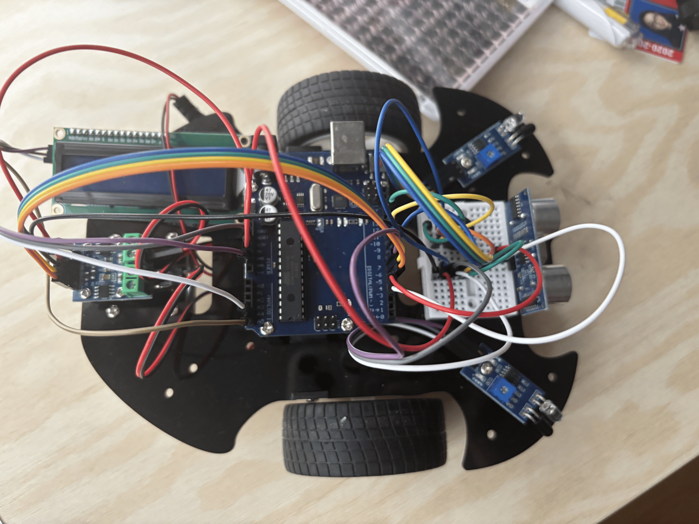
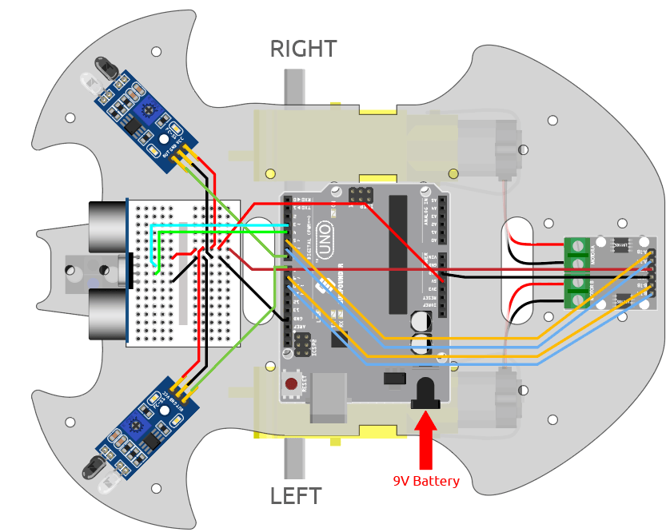

# Human Following Robot
In this project, I was able to build a human-following robot that uses infrared and ultrasonic sensors to detect and avoid obstacles in real-time. One of my biggest setbacks while working on this project was learning how to utilize C++ to code for the robot to move forward reliably. Additionally, I often made mistakes in my wiring between the Arduino Uno board and the sensors, which further led me to do more troubleshooting in the process. However, overcoming this challenge was both rewarding and allowed me to gain further skills in engineering and coding. 

You should comment out all portions of your portfolio that you have not completed yet, as well as any instructions:
```HTML 
<!--- This is an HTML comment in Markdown -->
<!--- Anything between these symbols will not render on the published site -->
```

| **Engineer** | **School** | **Area of Interest** | **Grade** |
|:--:|:--:|:--:|:--:|
| Hebe S. | Galileo Academy of Science and Technology | Chemical Engineering | Incoming Senior

**Replace the BlueStamp logo below with an image of yourself and your completed project. Follow the guide [here](https://tomcam.github.io/least-github-pages/adding-images-github-pages-site.html) if you need help.**


  
# Final Milestone

<iframe width="560" height="315" src="https://www.youtube.com/embed/kWnB9jM6kpA?si=0DL_Ej2tFNCeidtg" title="YouTube video player" frameborder="0" allow="accelerometer; autoplay; clipboard-write; encrypted-media; gyroscope; picture-in-picture; web-share" referrerpolicy="strict-origin-when-cross-origin" allowfullscreen></iframe>

For your final milestone, explain the outcome of your project. Key details to include are:
For my final milestone, I added a piezo buzzer that plays a full melody of "Never Going to Give You Up" as the robot moves. Normally, playing music can block the rest of the program, which would freeze everything else. To solve that, I used non-blocking code with the millis() function. This means the robot can multitask—move, think, and play music—all at the same time. A challenge during this part was coding each note of the piece, and it required a lot of determination and independence. The second biggest challenge I faced was getting all of these components to work together smoothly. At first, using delay() in my music code caused the robot which allowed the robot to move and play music simultaneously without interruptions. This was one of the first projects I’ve ever done where I brought together mechanical construction and coding, and seeing it all move and react in real time felt incredibly satisfactory and rewarding. I joined BlueStamp to combine my science and math interests into one, and seeing how hands-on BlueStamp was really gave me a lot of knowledge into the field of Engineering and really encouraged me to consider pursuing it in college. 


# Second Milestone


<iframe width="560" height="315" src="https://www.youtube.com/embed/BpEaHnyZcQY?si=-c-jovfgBJTjMIl6" title="YouTube video player" frameborder="0" allow="accelerometer; autoplay; clipboard-write; encrypted-media; gyroscope; picture-in-picture; web-share" referrerpolicy="strict-origin-when-cross-origin" allowfullscreen></iframe>

For my Second Milestone, I wired the ultrasonic sensor (HC-SR04) to the Arduino's trigPin and echoPin, placing it at the front of the robot to detect objects ahead. I also installed two IR obstacle sensors—one on the left and one on the right—to detect nearby walls or barriers that the ultrasonic sensor might miss. For feedback, I connected a 16x2 I2C LCD screen to the Arduino using just two wires: SDA and SCL. This kept my wiring clean and efficient while allowing me to display live status messages like "Moving Forward," "Turning Left," or "Too Close: Stop." I've also coded it so that when the object is not within 5-15cm, it will also turn towards its IR sensors to avoid obstacles. The hardest challenge during this was making sure all my pins were in the right spot because pin conflicts were super annoying and tedious to troubleshoot. For my future milestone, I'm looking forward to incorporating a piezo buzzer to play music as the robot moves. 

# First Milestone


<iframe width="560" height="315" src="https://www.youtube.com/embed/Blt-8qQZbdY?si=nN1j8mKGHjOSlnrk" title="YouTube video player" frameborder="0" allow="accelerometer; autoplay; clipboard-write; encrypted-media; gyroscope; picture-in-picture; web-share" referrerpolicy="strict-origin-when-cross-origin" allowfullscreen></iframe>

My project is a human-tracking robot that can detect and follow a person while maintaining a predetermined distance. For my first milestone, I used components provided to me by the SunFounder Kit, such as the Arduino microcontroller, distance-measuring ultrasonic sensors, infrared sensors to detect obstacles, motor drivers, and DC motors for making movement, to build the foundation of my robot. The Arduino is the core aspect of my project. It reads sensor data, makes decisions, and sends data points out to the other components of the robot. The Arduino is the one that records data points to send them to the motor driver, allowing the robot to move using two DC motors, which are connected to motor driver pins on the Arduino. By using analogWrite() to send PWM signals, the Arduino can adjust motor speed and direction. For example, if the robot needs to turn, it slows down one motor while keeping the other running, which creates a smooth curve instead of a sharp pivot. During this project, I've also added 2 infrared (IR) sensors, one to the left and one to the right of the robot, and an ultrasonic sensor mounted at the front. The IR sensors detect reflected light to tell you where the object is, while the ultrasonic sensors use sound waves to measure the distance of the object. These components work together by having the sensors receive environmental information, which the Arduino calculates to send signals to the motors to move forward, backward, or turn whenever needed. I have additionally assembled the robot hardware, connected the sensors and motors, and started programming simple movement functionality using C++. My achievements so far are having successfully programmed the robot to move forward and reverse based on sensor input, and additionally, being able to detect something and turn towards it. My main challenges that I am facing include accurately processing sensor information for smooth functionality and debugging wiring issues. By the next milestone, I hope to work on the sensor input processing and improve the robot's response to movement. My strategy to finish the project is to create and implement the human-following algorithm and to achieve stable obstacle avoidance so that the robot can safely and effectively track a human, as well as think of future modifications to bring to the project. 

# Schematics 



# Code

```#include <Wire.h>
#include <LiquidCrystal_I2C.h>
#include "pitches.h"

// Motor pins
const int A_1B = 5;
const int A_1A = 6;
const int B_1B = 9;
const int B_1A = 10;

// IR sensors
const int rightIR = 7;
const int leftIR = 8;

// Ultrasonic sensor pins
const int trigPin = 3;
const int echoPin = 4;

// Buzzer pin
const int buzzerPin = 11;

// LCD setup (address may need to be changed to 0x3F if 0x27 doesn't work)
LiquidCrystal_I2C lcd(0x27, 16, 2);

// Melody data
int melody[] = {
  NOTE_A4, REST, NOTE_B4, REST, NOTE_C5, REST, NOTE_A4, REST,
  NOTE_D5, REST, NOTE_E5, REST, NOTE_D5, REST,
  NOTE_G4, NOTE_A4, NOTE_C5, NOTE_A4, NOTE_E5, NOTE_E5, REST,
  NOTE_D5, REST,
  NOTE_G4, NOTE_A4, NOTE_C5, NOTE_A4, NOTE_D5, NOTE_D5, REST,
  NOTE_C5, REST, NOTE_B4, NOTE_A4, REST,
  NOTE_G4, NOTE_A4, NOTE_C5, NOTE_A4, NOTE_C5, NOTE_D5, REST,
  NOTE_B4, NOTE_A4, NOTE_G4, REST, NOTE_G4, REST, NOTE_D5, REST, NOTE_C5, REST,
  NOTE_G4, NOTE_A4, NOTE_C5, NOTE_A4, NOTE_E5, NOTE_E5, REST,
  NOTE_D5, REST,
  NOTE_G4, NOTE_A4, NOTE_C5, NOTE_A4, NOTE_G5, NOTE_B4, REST,
  NOTE_C5, REST, NOTE_B4, NOTE_A4, REST,
  NOTE_G4, NOTE_A4, NOTE_C5, NOTE_A4, NOTE_C5, NOTE_D5, REST,
  NOTE_B4, NOTE_A4, NOTE_G4, REST, NOTE_G4, REST, NOTE_D5, REST, NOTE_C5, REST,
  NOTE_C5, REST, NOTE_D5, REST, NOTE_G4, REST, NOTE_D5, REST, NOTE_E5, REST,
  NOTE_G5, NOTE_F5, NOTE_E5, REST,
  NOTE_C5, REST, NOTE_D5, REST, NOTE_G4, REST
};

int durations[] = {
  8, 8, 8, 8, 8, 8, 8, 4,
  8, 8, 8, 8, 2, 2,
  8, 8, 8, 8, 2, 8, 8,
  2, 8,
  8, 8, 8, 8, 2, 8, 8,
  4, 8, 8, 8, 8,
  8, 8, 8, 8, 2, 8, 8,
  2, 8, 4, 8, 8, 8, 8, 8, 1, 4,
  8, 8, 8, 8, 2, 8, 8,
  2, 8,
  8, 8, 8, 8, 2, 8, 8,
  2, 8, 8, 8, 8,
  8, 8, 8, 8, 2, 8, 8,
  4, 8, 3, 8, 8, 8, 8, 8, 1, 4,
  2, 6, 2, 6, 4, 4, 2, 6, 2, 3,
  8, 8, 8, 8,
  2, 6, 2, 6, 2, 1
};

// Variables to manage melody timing
int currentNote = 0;
unsigned long noteStartTime = 0;
int noteDuration = 0;

void setup() {
  Serial.begin(9600);

  // Motor pins
  pinMode(A_1B, OUTPUT);
  pinMode(A_1A, OUTPUT);
  pinMode(B_1B, OUTPUT);
  pinMode(B_1A, OUTPUT);

  // IR sensors
  pinMode(leftIR, INPUT);
  pinMode(rightIR, INPUT);

  // Ultrasonic sensor
  pinMode(echoPin, INPUT);
  pinMode(trigPin, OUTPUT);

  // Buzzer
  pinMode(buzzerPin, OUTPUT);

  // LCD init
  lcd.init();
  lcd.backlight();
  lcd.clear();
  lcd.setCursor(0, 0);
  lcd.print("Robot Starting");
  delay(1000);
  lcd.clear();
}

void loop() {
  float distance = readSensorData();

  int left = digitalRead(leftIR);   // 0: Obstructed, 1: Clear
  int right = digitalRead(rightIR);

  int speed = 150;

  // Display distance on first line
  lcd.setCursor(0, 0);
  lcd.print("Dist:");
  if (distance > 0) {
    lcd.print(distance, 1);
    lcd.print(" cm   "); // spaces clear leftovers
  } else {
    lcd.print("N/A    ");
  }

  // Movement and status logic
  if (distance > 5 && distance < 15) {
    moveForward(speed);
    lcd.setCursor(0, 1);
    lcd.print("Moving Forward   ");
  } else if (distance > 0 && distance <= 5) {
    stopMove();
    lcd.setCursor(0, 1);
    lcd.print("Too Close: Stop  ");
  } else {
    if (!left && right) {
      turnLeft(speed);
      lcd.setCursor(0, 1);
      lcd.print("Turning Left    ");
    } else if (left && !right) {
      turnRight(speed);
      lcd.setCursor(0, 1);
      lcd.print("Turning Right   ");
    } else {
      stopMove();
      lcd.setCursor(0, 1);
      lcd.print("Stopped         ");
    }
  }

  // Serial debug
  Serial.print("Distance: ");
  Serial.print(distance);
  Serial.print(" cm, Left IR: ");
  Serial.print(left);
  Serial.print(", Right IR: ");
  Serial.println(right);

  // Play melody non-blocking
  playMelodyNonBlocking();

  delay(50);
}

float readSensorData() {
  digitalWrite(trigPin, LOW);
  delayMicroseconds(2);
  digitalWrite(trigPin, HIGH);
  delayMicroseconds(10);
  digitalWrite(trigPin, LOW);

  long duration = pulseIn(echoPin, HIGH, 30000);  // 30ms timeout

  if (duration == 0) {
    return -1.0;
  } else {
    float distance = duration / 58.0;
    return distance;
  }
}

void moveForward(int speed) {
  analogWrite(A_1B, 0);
  analogWrite(A_1A, speed);
  analogWrite(B_1B, speed);
  analogWrite(B_1A, 0);
}

void moveBackward(int speed) {
  analogWrite(A_1B, speed);
  analogWrite(A_1A, 0);
  analogWrite(B_1B, 0);
  analogWrite(B_1A, speed);
}

void turnLeft(int speed) {
  int slowSpeed = speed / 2;  // slow down one motor to half speed
  analogWrite(A_1B, 0);
  analogWrite(A_1A, speed);   // full speed on left motor forward
  analogWrite(B_1B, 0);
  analogWrite(B_1A, slowSpeed); // half speed on right motor forward
}

void turnRight(int speed) {
  int slowSpeed = speed / 2;  // slow down one motor to half speed
  analogWrite(A_1B, slowSpeed); // half speed on left motor backward
  analogWrite(A_1A, 0);
  analogWrite(B_1B, speed);   // full speed on right motor backward
  analogWrite(B_1A, 0);
}


void stopMove() {
  analogWrite(A_1B, 0);
  analogWrite(A_1A, 0);
  analogWrite(B_1B, 0);
  analogWrite(B_1A, 0);
}

// Non-blocking melody player function
void playMelodyNonBlocking() {
  unsigned long currentTime = millis();

  if (currentNote >= (sizeof(durations) / sizeof(int))) {
    currentNote = 0;  // Restart melody after finishing
  }

  if (noteStartTime == 0 || currentTime - noteStartTime >= noteDuration) {
    // Stop previous note
    noTone(buzzerPin);

    // Calculate duration of this note
    noteDuration = 1000 / durations[currentNote];

    if (melody[currentNote] == REST) {
      // Rest: no tone, just delay
      noTone(buzzerPin);
    } else {
      tone(buzzerPin, melody[currentNote], noteDuration);
    }

    noteStartTime = currentTime;
    currentNote++;
  }
}

```

# Bill of Materials
Here's where you'll list the parts in your project. To add more rows, just copy and paste the example rows below.
Don't forget to place the link of where to buy each component inside the quotation marks in the corresponding row after href =. Follow the guide [here]([url](https://www.markdownguide.org/extended-syntax/)) to learn how to customize this to your project needs. 

| **Part** | **Note** | **Price** | **Link** |
|:--:|:--:|:--:|:--:|
| Item Name | What the item is used for | $Price | <a href="https://www.amazon.com/Arduino-A000066-ARDUINO-UNO-R3/dp/B008GRTSV6/"> Link </a> |
| Item Name | What the item is used for | $Price | <a href="https://www.amazon.com/Arduino-A000066-ARDUINO-UNO-R3/dp/B008GRTSV6/"> Link </a> |
| Item Name | What the item is used for | $Price | <a href="https://www.amazon.com/Arduino-A000066-ARDUINO-UNO-R3/dp/B008GRTSV6/"> Link </a> |

# Other Resources/Examples
One of the best parts about Github is that you can view how other people set up their own work. Here are some past BSE portfolios that are awesome examples. You can view how they set up their portfolio, and you can view their index.md files to understand how they implemented different portfolio components.
- [Example 1](https://trashytuber.github.io/YimingJiaBlueStamp/)
- [Example 2](https://sviatil0.github.io/Sviatoslav_BSE/)
- [Example 3](https://arneshkumar.github.io/arneshbluestamp/)

To watch the BSE tutorial on how to create a portfolio, click here.
